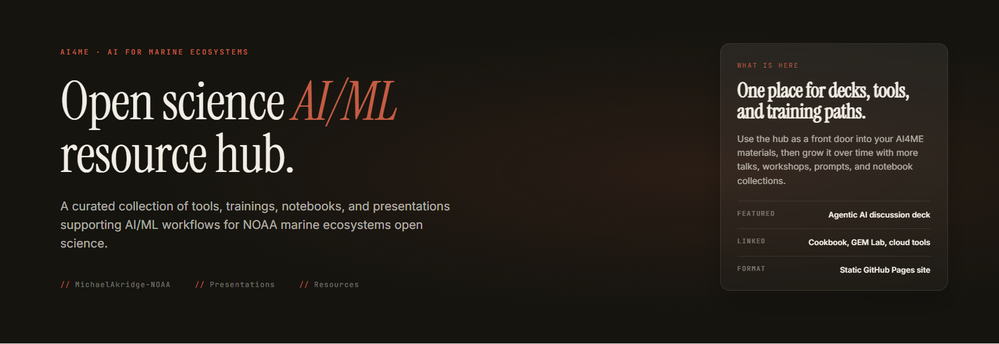
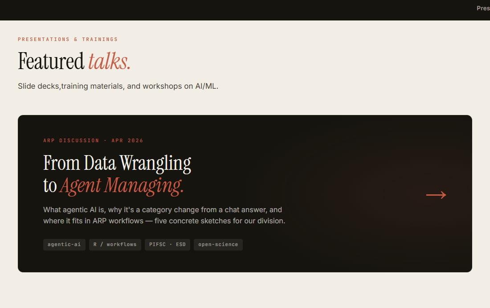
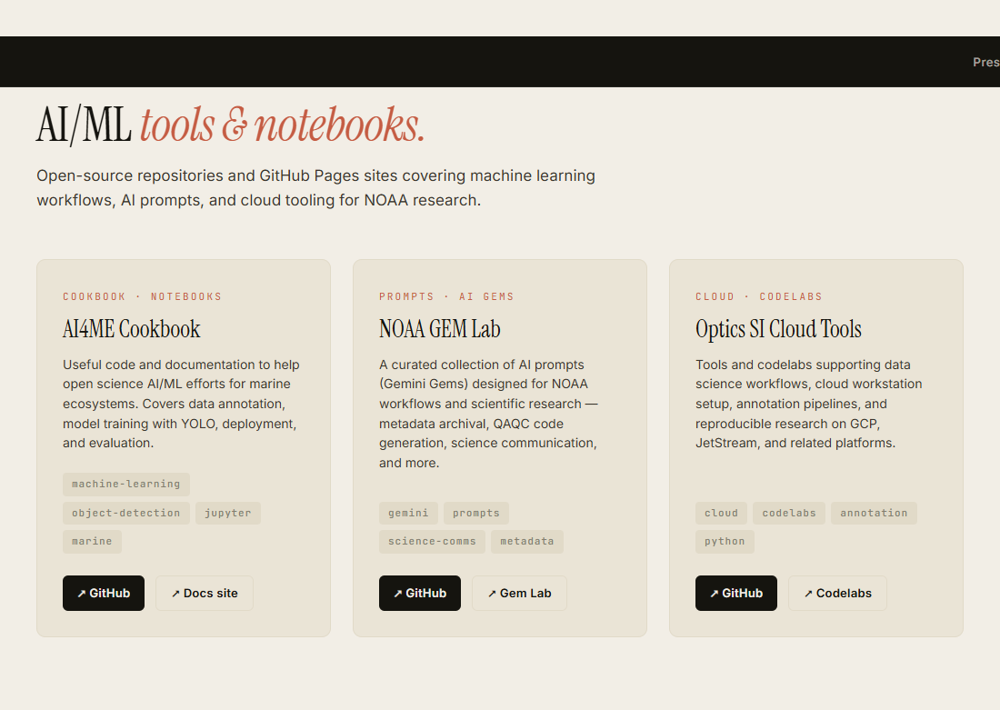

# AI4ME Open Science | Resource Hub
A curated collection of AI/ML resources, presentations, and open-science tools for **AI Marine Ecosystem** research.

**Link → [michaelakridge-noaa.github.io/ai4me-open-science](https://michaelakridge-noaa.github.io/ai4me-open-science)**
---

## Screenshots
| Home Page |  Presentations | Resource Links |
|------|-----------------------|----------------|
|  |  |  |

## Related Resources

- **AI4ME Cookbook** — AI/ML Computer Vision workflows and notebooks for marine ecosystems  
  <https://github.com/MichaelAkridge-NOAA/ai4me-cookbook>

- **Gemini GEM Lab** — Curated Gemini AI prompts for NOAA scientific workflows  
  <https://github.com/MichaelAkridge-NOAA/noaa-gem-lab>

- **Optics SI Cloud Tools** — Cloud workstation setup, codelabs, and annotation pipelines  
  <https://github.com/MichaelAkridge-NOAA/optics-si-cloud-tools>

## Disclaimer
This repository is a scientific product and is not official communication of the National Oceanic and Atmospheric Administration, or the United States Department of Commerce. All NOAA GitHub project content is provided on an ‘as is’ basis and the user assumes responsibility for its use. Any claims against the Department of Commerce or Department of Commerce bureaus stemming from the use of this GitHub project will be governed by all applicable Federal law. Any reference to specific commercial products, processes, or services by service mark, trademark, manufacturer, or otherwise, does not constitute or imply their endorsement, recommendation or favoring by the Department of Commerce. The Department of Commerce seal and logo, or the seal and logo of a DOC bureau, shall not be used in any manner to imply endorsement of any commercial product or activity by DOC or the United States Government.

## License
See [LICENSE.md](LICENSE.md).
